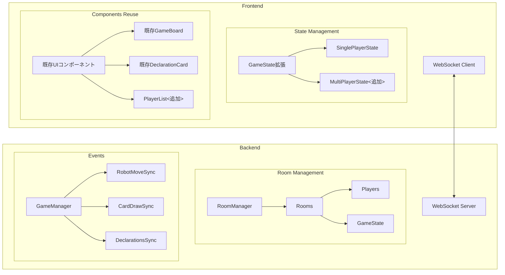

# リコシェロボット オンライン対戦実装計画

## 概要
シングルプレイヤーの機能を基本としつつ、オンライン対戦機能を追加する。既存のUIコンポーネントを最大限活用し、WebSocketを用いた通信機能を実装する。

## システム構成



## 実装詳細

### 1. 型定義の拡張
```typescript
// プレイヤーを表す型
type Player = {
  id: string;
  name: string;
  score: number;
  isGameMaster: boolean;
};

// 宣言を表す型
type Declaration = {
  playerId: string;
  playerName: string;
  moves: number;
  timestamp: number;
};

// マルチプレイヤーの状態を表す型
type MultiPlayerState = {
  players: Player[];
  declarations: Declaration[];
  currentPlayerId: string | null;
  gameMasterId: string;
  roomId: string;
};

// GameStateの拡張
type GameState = {
  ...
  mode: 'single' | 'multi';
  multiPlayer?: MultiPlayerState;
};
```

### 2. WebSocket イベント定義
```typescript
type WebSocketEvents = {
  // ルーム関連
  'room:join': { roomId: string, playerName: string };
  'room:joined': { playerId: string, isGameMaster: boolean };
  
  // ゲーム進行
  'game:card_draw': { card: Card };
  'game:declare': { moves: number };
  'game:declarations_update': { declarations: Declaration[] };
  'game:robot_move': { robotColor: RobotColor, path: Position[] };
  'game:robot_move_sync': { robotColor: RobotColor, currentPosition: Position };
  'game:goal_achieved': { playerId: string };
  
  // 状態同期
  'game:state_sync': { gameState: GameState };
};
```

### 3. useGameStateの拡張
- WebSocket通信の統合
- マルチプレイヤーモードの対応
- ゲームマスター権限の制御
- ロボットの移動同期

### 4. サーバーサイド実装
1. Socket.ioサーバー
2. ルーム管理システム
3. ゲーム状態の同期処理
4. 宣言の収集と順序付け
5. ロボットの移動同期

## 実装の優先順位

1. WebSocketサーバーの基本セットアップ
2. ルーム参加とプレイヤー管理
3. ゲームマスター機能
4. 宣言フェーズの同期
5. ロボットの移動同期
6. スコア管理

## 注意点

1. 既存のUIコンポーネントを最大限活用する
2. ゲームマスター権限は「カードをめくる」機能のみに制限
3. ロボットの動きはすべてのプレイヤーにリアルタイムで同期
4. シンプルな実装を心がけ、不必要な機能は追加しない